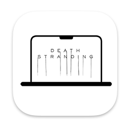

# DS Aspect Ratio Tool
Aspect ratio and resolution change tool for the DEATH STRANDING Director's Cut for macOS
 - Supports various resolution presets for 16:10 aspect ratios not supported by the game.
 - Can apply various custom resolutions with custom settings.

## Installation
Download the latest version of the PKG installer from the [download page](link-to-download-page) and run it


## Usage

 1. Click on the <kbd>Open file</kbd> button to locate the `Setting.cfg` file. The file is typically found at:
    
    
    ```sh
    /Users/YOUR_USERNAME/Library/Containers/com.505games.deathstranding/Data/Setting.cfg
    ```    
 1. Select the desired resolution from the list and click <kbd>Apply</kbd>.
 1. If your preferred resolution is not available, choose `Custom` from the list and enter your custom resolution settings.

>[!TIP]
> If you cannot find the `Setting.cfg` file in the specified path, try launching the game at least once.

