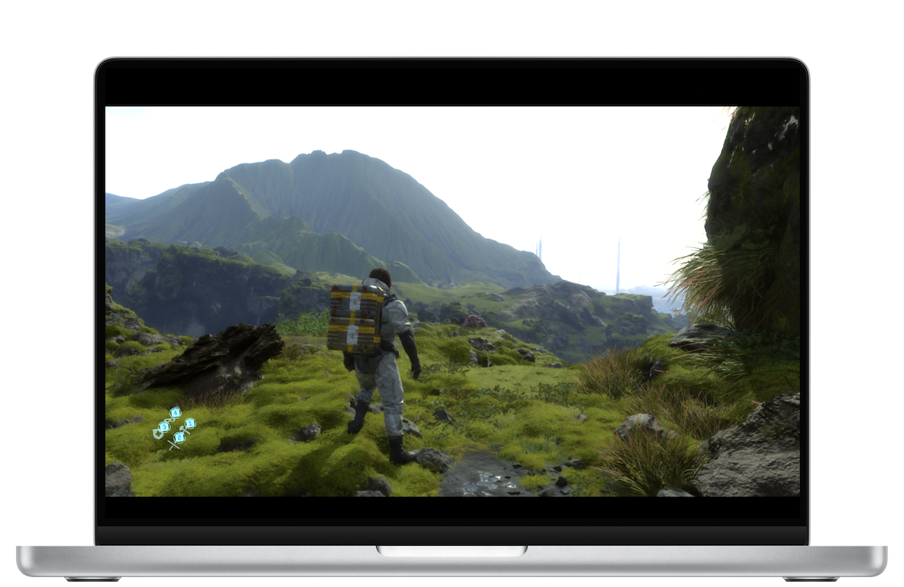
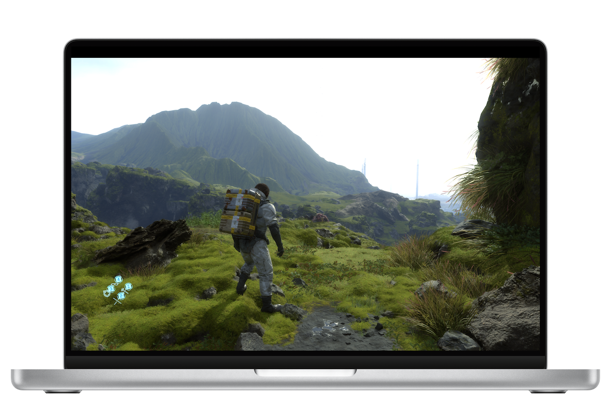
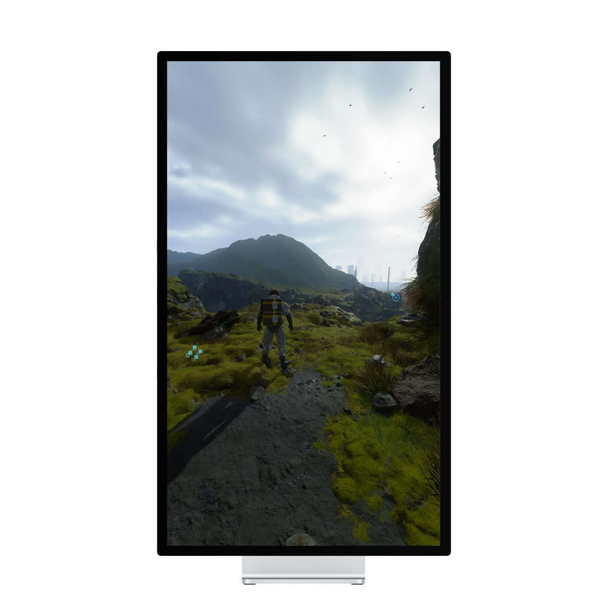

# DS Aspect Ratio Tool
Aspect ratio and resolution change tool for the DEATH STRANDING Director's Cut for macOS
 - Supports various resolution presets for 16:10 aspect ratios not supported by the game.
 - Can apply various custom resolutions with custom settings.

## Installation
Download the latest version of the `dmg` installer from the [download page](https://github.com/devleomk1/DS-display-ratio/releases/) and run it


## Usage
<p align="center">
  
</p>

 1. Click on the <kbd>Open file</kbd> button to locate the `Setting.cfg` file. The file is typically found at:

    
    ```sh
    /Users/YOUR_USERNAME/Library/Containers/com.505games.deathstranding/Data/Setting.cfg
    ```    
 1. Select the desired resolution from the list and click <kbd>Apply</kbd>.
 1. If your preferred resolution is not available, choose `Custom` from the list and enter your custom resolution settings.

>[!TIP]
> If you cannot find the `Setting.cfg` file in the specified path, try launching the game at least once.

>[!TIP]
> Menu screen, loading screens and cutscenes do not change aspect ratio.

## Examples

### MacBook Pro 14-inch


 - The left image shows the game at the default 16:9 aspect ratio (1600x900 resolution).
 - On the right, the aspect ratio is adjusted to 16:10 (3024x1890 native resolution of MacBook Pro 14-inch) using the DS  Ratio Aspect Tool.

### Vertical Display


 - If you choose custom settings, you can apply various resolutions not available in the presets.
 - The above images depict gameplay on a vertical display (1080x1920 resolution).

