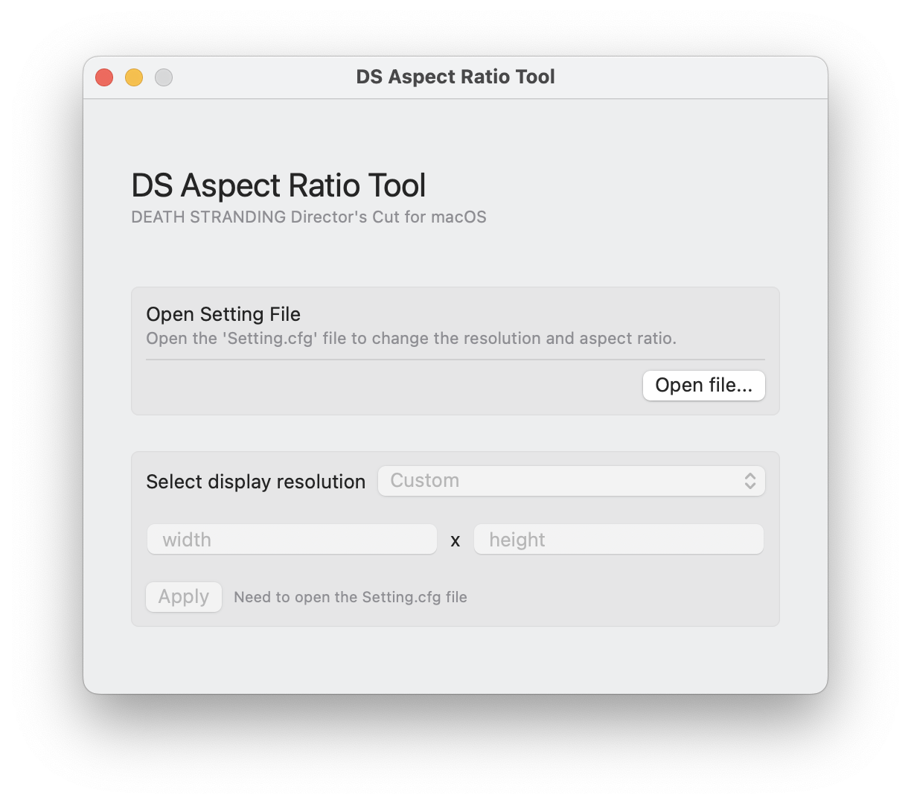

# DS Aspect Ratio Tool
Aspect ratio and resolution change tool for the DEATH STRANDING Director's Cut for macOS
 - 게임에서 지원하지 않는 16:10 화면비의 다양한 해상도 프리셋을 지원합니다.
 - 커스텀 설정으로 다양한 커스텀 해상도를 적용 할 수 있습니다.

## Installation
다운로드 페이지에서 가장 높은 버전의 pkg를 다운받아 실행하고 설치합니다.

## Usage

 1. 오픈파일 버튼을 눌러 아래 경로에 위치한 `Setting.cfg` 파일을 엽니다.
    
    ```sh
    /Users/{USER_NAME}/Library/Containers/com.505games.deathstranding/Data/Setting.cfg
    ```    
 1. 목록에서 원하는 해상도를 선택하고 <kbd>Apply</kbd> 버튼을 누르세요.
 1. 원하는 해상도가 없다면 목록에서 `Custom`을 선택하고 직접 해상도를 입력하세요.

>[!TIP]
> 경로에서 `Setting.cfg` 파일을 찾을 수 없다면 게임을 한번 실행하세요.

## 

